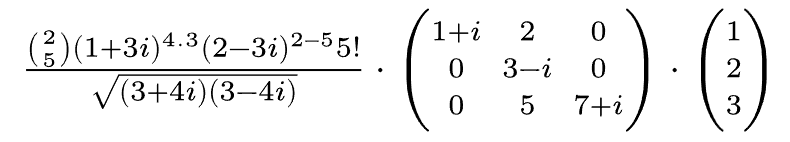
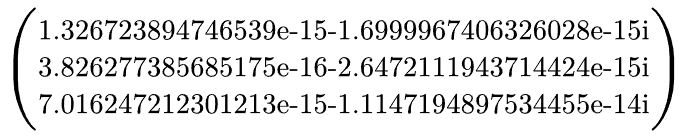
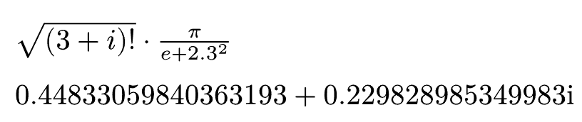
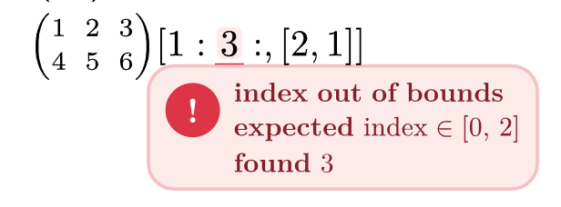

# Kalt

Kalt evaluates arbitrary nested equations and removes the need to transcribe
your equations into the default `calc` system. It supports scalars, complex
numbers, matrices, vectors, and matrix indexing while keeping the result as
normal Typst content.

Complex equation?



```typst
$comp(frac(binom(2, 5) (1 + 3 i)^4.3 (2 - 3 i)^(2-5) 5!, sqrt((3+4i)(3-4i))) dot mat(
    1+i, 2, 0;
    0, 3-i, 0;
    0, 5, 7+i;
) dot vec(1, 2, 3))$
```



## Import and start evaluating

```typst
#import "@preview/kalt:0.1.0": comp;
```

`comp` evaluates the supplied math content and returns Typst content. This means
the result can still be assigned, formatted, indexed, or combined with other
Typst expressions.

## Supported Operations

The following operations are currently supported by the Rust backend and
available through `comp`.

### Arithmetic

- `+` — addition. Scalars can be combined with matrices, and matrices are added
  element-wise when they have the same shape.
- `-` — subtraction with the same element-wise matrix rules.
- `*` — element-wise multiplication. Scalar-matrix multiplication is also
  applied element-wise.
- `/` — element-wise division.
- `^` — exponentiation.
- `!` — factorial.
- `binom(a, b)` — binomial coefficient. For matrices, both arguments must have
  the same shape and the operation is applied element-wise.
- `root(x, n)` — nth root.
- `sqrt(x)` — square root.
- `abs(x)` — absolute value or complex magnitude.
- `ceil(x)` — ceiling, applied element-wise to matrices.
- `floor(x)` — floor, applied element-wise to matrices.
- `sign(x)` — sign operation, applied element-wise to matrices.

```typst
$comp(sqrt((3+i)!)) dot pi/(e + 2.3^2)$
```



### Complex Numbers

Complex numbers are supported at any position in an equation.

- `conjugate(x)` — complex conjugate.
- `Re(x)` — real part.
- `Im(x)` — imaginary part.

```typst
$comp(e^(i pi))$ // => -1
$comp(conjugate(2 + 3i))$ // => 2 - 3i
$comp(Re(2 + 3i) + i Im(2 + 3i))$ // => 2 + 3i
```

### Matrices and Vectors

- `dot` — dot product and matrix multiplication for supported vector/matrix
  shapes.
- `cross` — cross product for three-dimensional vectors.
- `T` / `transpose` — matrix transpose.
- indexing — matrix element access and slicing.

```typst
$comp(mat(1/i+2, 0)^T dot mat(1, 2))$
```

### Indexing

Matrices can be indexed using Typst-style indices and slices. Ranges can use
steps and negative steps, making it possible to reverse or subsample a matrix.

```typst
$comp(mat(1,2;4,5)[::, 1])$ // => mat(2; 5)
$comp(mat(1,2,3;4,5,6)[1:2:, [2,1]])$ // => mat(6, 5)
```

### Built-in Functions

- `ln(x)` — natural logarithm.
- `log_a(x)` — logarithm of `x` with base `a`.

```typst
$comp(ln(2^4))$ // => 4.0
$comp(log_2(16))$ // => 4.0
```

## Number Formats

Decimal, binary, and hexadecimal number literals can be used inside evaluated
expressions.

```typst
$comp("2.1e3"+1)$ // => 2101.0
$comp("0b010"*2)$ // => 4.0
$comp("0XFF"i/2)$ // => 127.5i
```

## Element-wise Operations and Mapping

Element-wise operations are supported by default for operations where the
backend defines an element-wise matrix implementation:

```typst
#let m = $mat(1,2,3;4,5,6)$
$comp(#m compose #m)$ // => mat(1, 4, 9; 16, 25, 36)
```

You can also apply custom mapping functions to each element in Typst:

```typst
#import "@preview/kalt:0.1.0": comp, map;

$map(mat(2, 2; 2, 6), #{ a => $#a + 3$ })$ // => mat(5, 5; 5, 9)
```

Or merge multiple matrices together:

```typst
#import "@preview/kalt:0.1.0": comp, merge;

$merge(#{ (a, b) => $log_#a (#b)$ }, mat(2, 2; 2, 2), mat(2, 2; 2, 8))$ // => mat(1, 1; 1, 3)
```

## Error Handling

Invalid operations and incompatible matrix shapes are returned as inlined Typst
error messages rather than causing the whole document to fail silently.



## Development

The heavy computation is implemented in Rust and exposed to Typst through Wasm.
The backend libraries for both `sertyp` and `kalt` are available as standalone
libraries and can be used independently.

The Typst-side tests are organized by operation under `tests/ops`. Shared test
helpers live in `tests/utils.typ`.

## Contributions

If an operation is missing, the usual contribution consists of implementing it
in the Rust backend, adding a Typst operation test, and updating the supported
operation list in this README. Improvements to error messages, matrix shape
handling, and number formatting are also useful contributions.
